# Guide – Utiliser GitHub Projects (Board)

GitHub Projects permet de gérer un projet de programmation sous forme de tableau (Kanban).  
C’est un outil pratique pour organiser vos récits utilisateurs, vos tâches et vos bogues.

---

## 1. Créer un nouveau projet

1. Dans GitHub, cliquez sur l’onglet **Projects**. 
2. Cliquez sur **New project**.   
   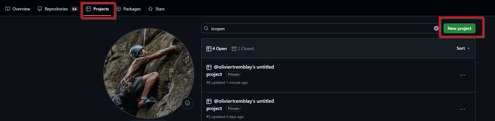

2. Choisissez le type **Board**.   
   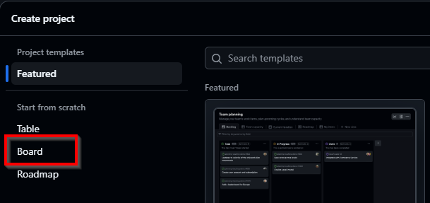

3. Donnez un **nom au projet** (ex. *Projet Prog*) et cliquez sur **Create project**.    
   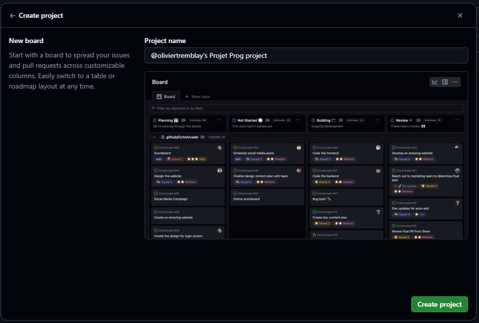

---

## 2. Créer et personnaliser vos colonnes

1. Par défaut, vous avez **Todo / In Progress / Done**.  
   Modifiez le nom et la description des colonnes en cliquant sur les `...` → **Edit details**.  
   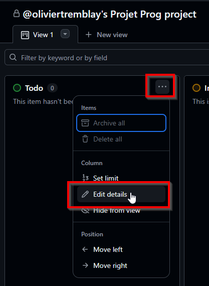

2. Donnez un nouveau nom et description à chaque colonne.  
   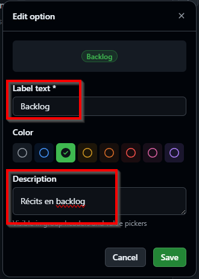

3. Pour ajouter une colonne, cliquez sur **+ New Column**.  
   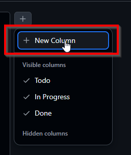

👉 Exemple de colonnes utiles :
- **Backlog** : Récits à réaliser pendant le projet.  
- **À faire** : Récits sélectionnés pour le sprint en cours.  
- **En cours** : Tâches actuellement en réalisation.  
- **Terminé** : Récits complétés.  
- **Bogues** : Problèmes à corriger avant la remise finale.  

---

## 3. Ajouter un récit utilisateur

1. Dans la colonne **Backlog**, cliquez sur **Add item**.  
   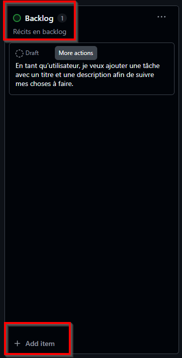

2. Choisissez entre :
   - **Create new issue** (lié au dépôt GitHub)  
   - **Create a draft** (si vous ne voulez pas travailler avec des Issues)  
   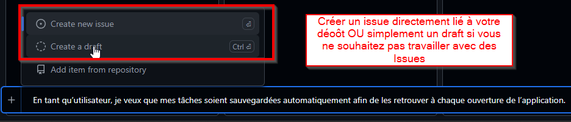 

---

## 4. Assigner un récit

Vous pouvez assigner un membre de l’équipe à un récit.  
Cliquez sur **Add assignees...** et sélectionnez la personne concernée.  
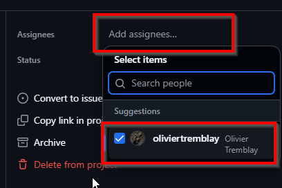

---

## 5. Ajouter des critères d’acceptation et tâches techniques

1. Cliquez sur un récit pour ouvrir ses détails.  
   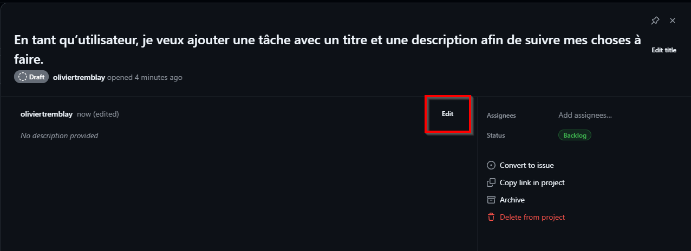
   
2. Ajoutez vos critères d’acceptation et tâches techniques en **Markdown**.  
   Exemple :  

   ```markdown
   ## Critères d'acceptation
   - L’utilisateur peut cliquer sur un bouton **« Ajouter une tâche »**.  
   - Un formulaire s’ouvre avec au moins deux champs obligatoires : **Titre** et **Description**.  
   - Si le titre est vide, un message d’erreur clair s’affiche et la tâche n’est pas enregistrée.  
   - Une fois validée, la nouvelle tâche apparaît immédiatement dans la liste.  
   - Les données de la tâche sont sauvegardées dans un fichier `.json` ou `.ini`.  

   ## Tâches techniques
   - [ ] Créer un formulaire « Nouvelle tâche »  
   - [ ] Créer une classe `Task` avec propriétés `Title` et `Description`  
   - [ ] Sauvegarder la tâche dans une liste en mémoire  
   - [ ] Rafraîchir l’affichage dans la liste des tâches

   ```
   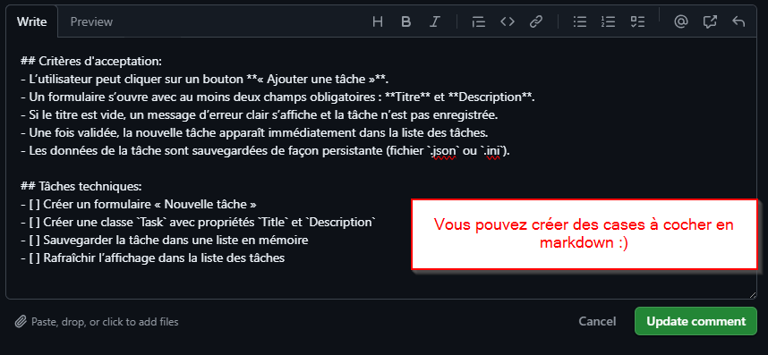 
   Rendu:
   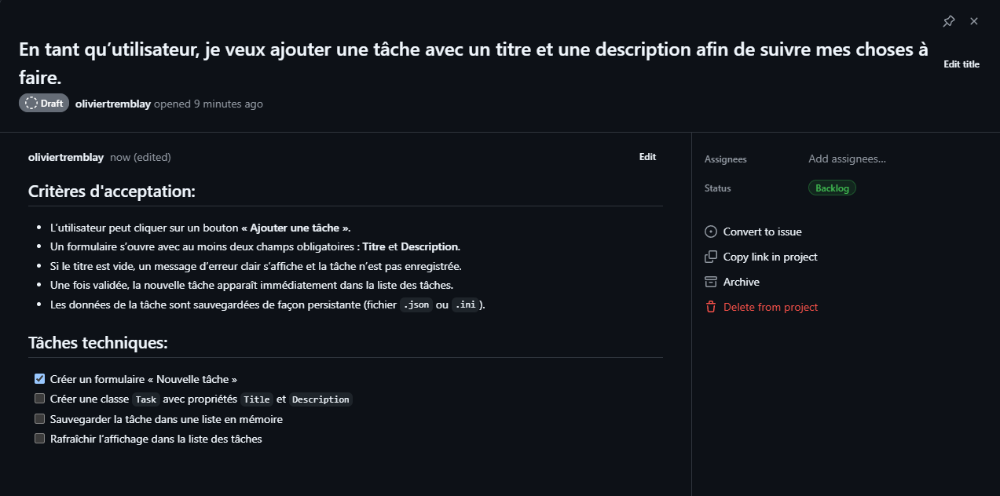

---

## 6. Exemple de projet
   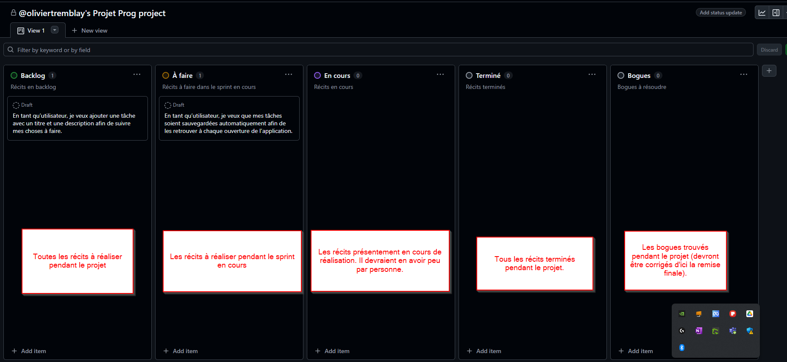

   
